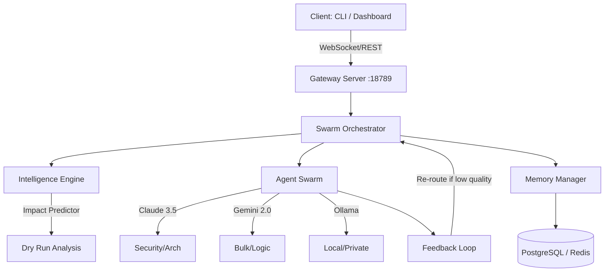

# 👻🧠 Phantom Neural Cortex v3.5 ✨ SMART SWARM EDITION

> Enterprise-Grade Multi-Agent Orchestration with Autonomous Swarm Intelligence

[](LICENSE)
[](CHANGELOG.md)
[](memory-bank/progress.md)

**A powerful AI orchestration platform featuring Intelligent Swarm Routing, Autonomous Feedback Loops, and Containerized Sandbox Execution.**

## 🚀 **The Evolution of v3.5** 🎯

We have surpassed the original modernization goals, integrating advanced orchestration logic that takes multi-agent systems to the next level.

### ✅ **Core v3.x Features:**

- **Intelligent Swarm Routing (Phase 5)** ✅ - Score-based agent selection (IntelligenceEngine).
- **Impact Prediction (Dry Run)** ✅ - Simulate cost, quality, and speed before execution.
- **Autonomous Feedback Loops** ✅ - Automatic re-routing and refinement if quality thresholds aren't met.
- **Advanced CLI & Dashboard (Phase 6)** ✅ - Interactive Socket.IO CLI and real-time swarm visualization.
- **Persistent Multi-Backend Memory (Phase 4)** ✅ - SQL (Postgres/SQLite) + Redis for long-term session recall.
- **Sandbox Hardening (Phase 7 - ACTIVE)** 🛡️ - Transitioning to Docker-based isolated execution.

---

## 🏗️ Architecture



---

## ⚡ Quick Start

```bash
# 1. Clone repository
git clone https://github.com/LEEI1337/phantom-neural-cortex
cd phantom-neural-cortex

# 2. Start Gateway & Backend
docker-compose up -d redis postgres
# Start the Gateway Server
python -m gateway.server

# 3. Launch the CLI Client
python cli.py

# 4. View the Dashboard
cd dashboard/frontend
npm run dev
```

---

## 🔧 New Key Components

### 🧠 Swarm Intelligence

The `IntelligenceEngine` analyzes task complexity and selects the optimal agent based on quality, speed, and cost requirements. No more hard-coded routing.

### 🔮 Impact Prediction

Before any tokens are spent, the `ImpactPredictor` provides a simulated report showing expected results across different priority profiles (Balanced, Quality, Speed, Cost).

### 🖥️ Interactive CLI

A premium command-line interface for real-time interaction:

- `/status`: System health and agent overview.
- `/swarm-status`: Active tasks and swarm configuration.
- `/preview <task>`: Run a dry-run impact simulation.
- `/context`: Monitor token usage and compaction status.

---

## 📈 Roadmap

- [x] **Phase 1-3**: Base OpenClaw Modernization (Context, Gateway, Skills)
- [x] **Phase 4**: Persistent Memory (SQL/Redis Integration)
- [x] **Phase 5**: Advanced Swarm Routing & Impact Prediction
- [x] **Phase 6**: CLI & Dashboard Enhancement (Visualizing the Swarm)
- [ ] **Phase 7**: Sandbox Hardening (Docker Isolation) - *In Progress*
- [ ] **Phase 8**: Multi-Channel Support (Telegram, Discord Bridges)

---

## 📄 Documentation

- [Sandbox Hardening Architecture](docs/architecture/SANDBOX_HARDENING.md)
- [Swarm Orchestration Logic](dashboard/backend/swarm/README.md)
- [Context Management](docs/CONTEXT_MANAGEMENT.md)
- [System Architecture](docs/SYSTEM_ARCHITECTURE_SUMMARY.md)

---

**Maintained by:** LEEI1337
**Version:** 3.5.0
**Last Updated:** Feb 2026
