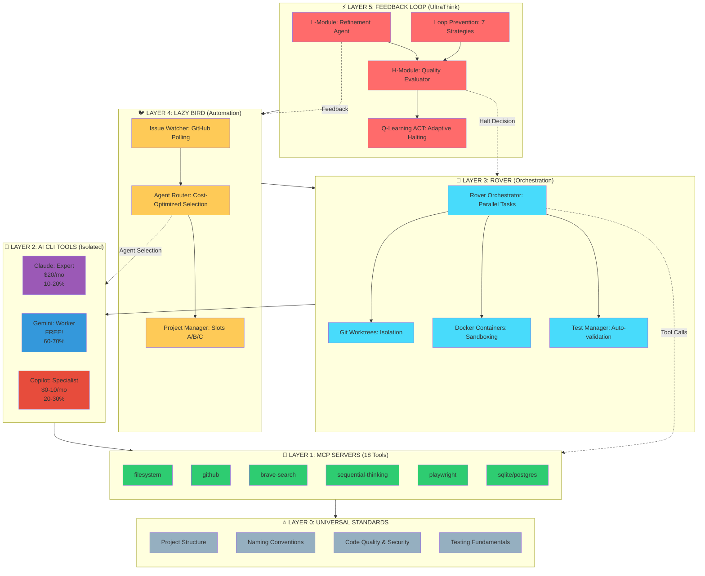
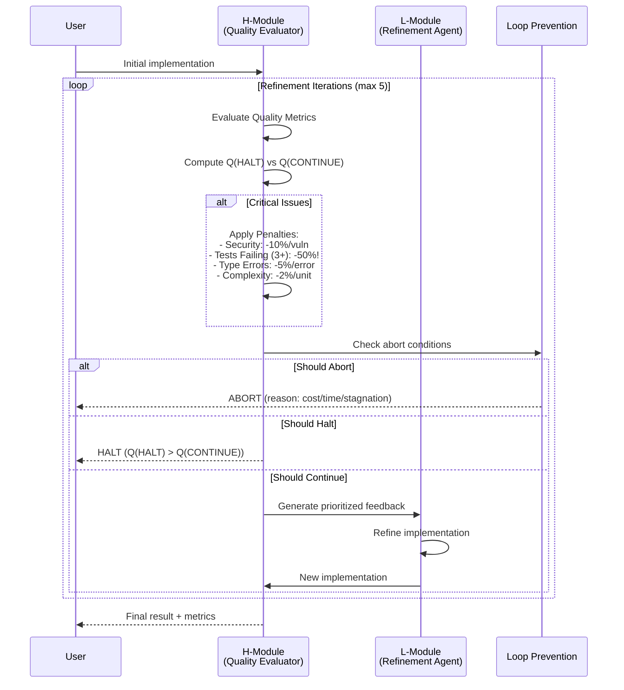
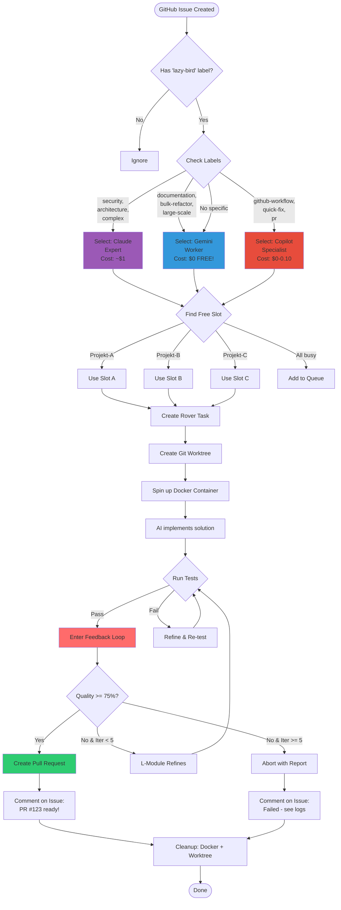
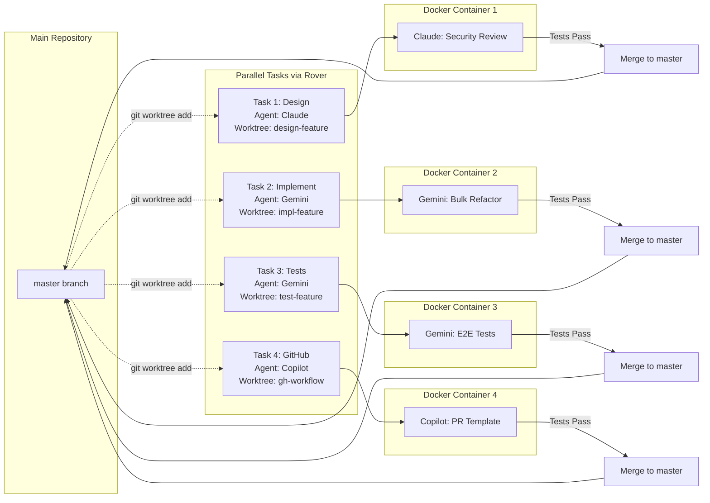
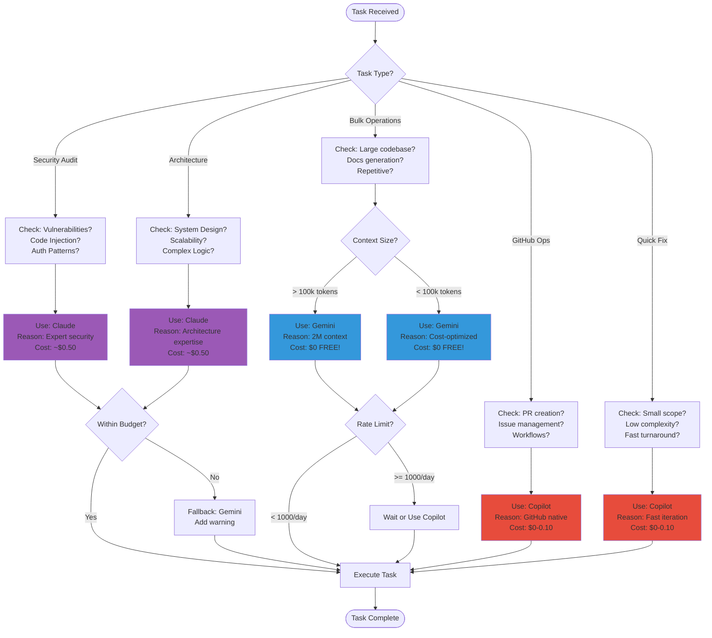
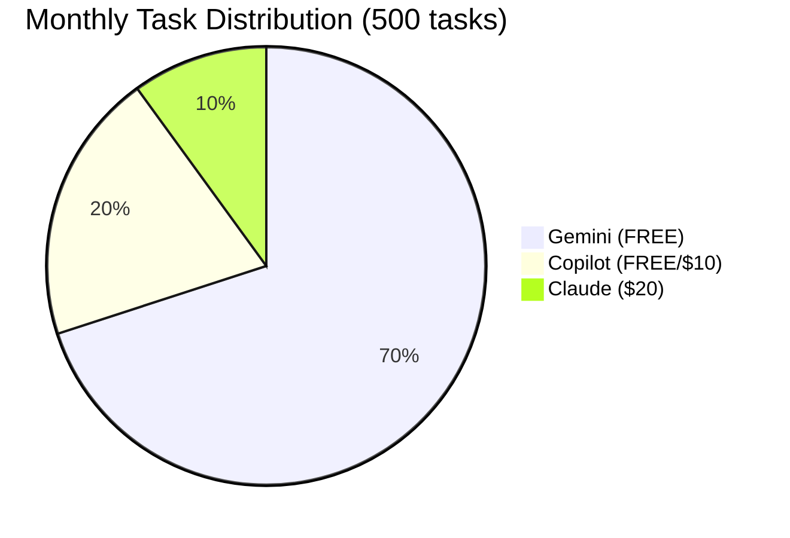
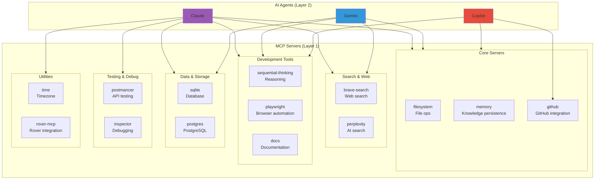
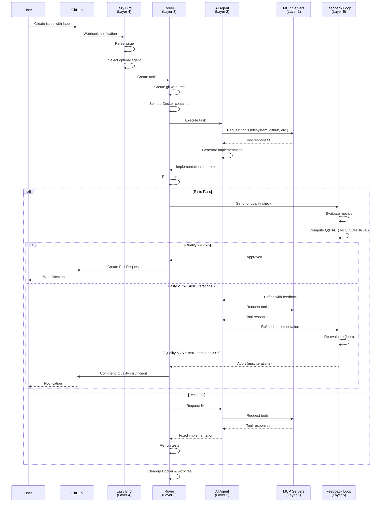
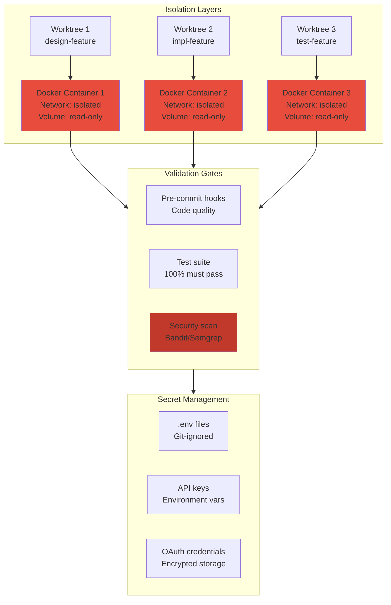

# 🏗️ Complete System Architecture

**AI Development Orchestrator - Full Layer Stack (0-5)**

---

## 📊 Visual Overview



---

## 🔄 Feedback Loop Flow (Layer 5)



---

## 🐦 Lazy Bird Workflow (Layer 4)



---

## 🚀 Rover Parallel Execution (Layer 3)



---

## 🤖 AI Agent Selection Logic (Layer 2)



---

## 📊 Cost Optimization Strategy



**Target Breakdown:**
- **Gemini:** 60-70% (300-350 tasks) = **$0** ✨
- **Copilot:** 20-30% (100-150 tasks) = **$0-10**
- **Claude:** 10-20% (50-100 tasks) = **$20** (Pro subscription)

**Total: $20-30/month** for ~500 tasks!

---

## 🔧 MCP Server Integration (Layer 1)



---

## 🎯 Complete Request Flow



---

## 📈 Performance Metrics

| Metric | Value | Notes |
|--------|-------|-------|
| **Setup Time** | ~45 min | One-time initial setup |
| **MCP Start** | ~10-15s | Server initialization |
| **Agent Response** | <3s | Average task pickup time |
| **Parallel Speedup** | 3-5x | vs. sequential execution |
| **Context Window** | Up to 2M | Gemini's massive context |
| **Daily Free Requests** | 1000 | Gemini API limit |
| **Monthly Cost** | $20-30 | With strategic free tier usage |
| **Q-Value Computation** | 0.0001ms | Feedback loop overhead |
| **Feedback Generation** | 0.0005ms | Per iteration |

---

## 🔒 Security & Isolation



---

## 📚 Documentation Structure

```
docs/
├── INDEX.md                          # Main documentation index
│
├── Quick Start (5 minutes)
│   ├── QUICKSTART-EN.md              # English setup guide
│   └── QUICKSTART-DE.md              # German setup guide
│
├── Architecture
│   ├── ARCHITECTURE-EN.md            # English architecture overview
│   ├── ARCHITECTURE-DE.md            # German architecture overview
│   ├── SYSTEM-ARCHITECTURE.md        # This file (visual diagrams)
│   └── architecture/
│       ├── ARCHITECTURE.md           # Detailed system design
│       ├── AI-CAPABILITY-MATRIX.md   # AI comparison matrix
│       └── CLAUDE-VS-COPILOT.md      # Detailed AI comparison
│
├── Lazy Bird (Layer 4 Automation)
│   ├── LAZY-BIRD-ARCHITECTURE.md     # Layer 0-4 design
│   ├── LAZY-BIRD-SETUP-EN.md         # English setup guide
│   ├── LAZY-BIRD-SETUP-DE.md         # German setup guide
│   └── LAZY-BIRD-SUMMARY.md          # Quick reference
│
├── Feedback Loop (Layer 5 UltraThink)
│   └── feedback-loop/
│       ├── FEEDBACK-LOOP-DESIGN.md   # System design
│       ├── FEEDBACK-LOOP-ANALYSIS.md # Critical analysis
│       └── OPTIMIZATION-SUMMARY.md   # Phase 1 improvements
│
├── Guides
│   ├── HOW-TO-CREATE-PROJECT.md      # Project creation guide
│   └── guides/
│       ├── BRANCH_PROTECTION.md      # GitHub branch protection
│       ├── ROVER-GUIDE.md            # Rover usage guide
│       └── ROVER-AI-SELECTOR.md      # AI selection logic
│
├── Setup & Verification
│   └── setup/
│       ├── SETUP-GUIDE.md            # Detailed setup steps
│       ├── SETUP-VERIFICATION.md     # Verification checklist
│       └── OPENHANDS-SETUP.md        # OpenHands setup
│
└── Reference
    └── MCP-SERVERS.md                # All 18 MCP servers
```

---

## 🎓 Next Steps

1. **Getting Started:** [QUICKSTART-EN.md](QUICKSTART-EN.md) or [QUICKSTART-DE.md](QUICKSTART-DE.md)
2. **Understand Architecture:** [ARCHITECTURE-EN.md](ARCHITECTURE-EN.md) or [ARCHITECTURE-DE.md](ARCHITECTURE-DE.md)
3. **Setup Lazy Bird:** [LAZY-BIRD-SETUP-EN.md](LAZY-BIRD-SETUP-EN.md)
4. **Explore Feedback Loop:** [feedback-loop/FEEDBACK-LOOP-DESIGN.md](feedback-loop/FEEDBACK-LOOP-DESIGN.md)
5. **Browse All Docs:** [INDEX.md](INDEX.md)

---

**Made with ❤️ by developers, for developers in Austria 🇦🇹**
